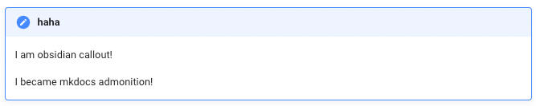

# mkdocs-obsidian-support-plugin
---
Plugin for [mkdocs-material](https://squidfunk.github.io/mkdocs-material/) to convert semantic in documentation from [obsidian](https://obsidian.md/) to mkdocs-material.

[](https://pypi.org/project/mkdocs-obsidian-support-plugin/)
[](https://github.com/ndy2/mkdocs-obsidian-support-plugin/blob/main/LICENSE.md)


```text
pip install mkdocs-obsidian-support-plugin
```

## Usage
---
Activate the plugin in mkdocs.yml 
```yaml
plugins:
  - search
  - obsidian-support
```


## features 
---

### 1. `obsidian callout` -> `mkdocs admonition`

in obsidian,
```text
>[!note] haha
>I am obsidian callout!
>
>I became mkdocs admonition!
```
rendered as with [obsidian callout](https://help.obsidian.md/Editing+and+formatting/Callouts)


in mkdocs-material,
this is equivalent to [mkdocs-material admonition](https://squidfunk.github.io/mkdocs-material/reference/admonitions/#custom-admonitions)

```text
!!!note "haha"

    I am obsidian callout!
    
    I became mkdocs admonition!
```

this plugin convert `callout` to `admonition` based on regex.
finally it rendered as below in mkdocs-material



💡 common types that `obsidian callout` and `mkdocs-material admonition` support

- note
- abstract
- info
- tip
- success
- question
- warning
- failure
- danger
- bug
- example
- quote

#### 2. `obsidian wikilink image` -> `mkdocs mdlink image`

Obsidian support [`wikilink`](https://help.obsidian.md/Linking+notes+and+files/Internal+links) (and this [link](https://help.obsidian.md/Linking+notes+and+files/Embedding+files)) which is also known as `internal link`.
However mkdocs does not support `wikilink`. It uses traditional [`markdown links`](https://squidfunk.github.io/mkdocs-material/reference/images/).

```
wikilink :  ![[images/hello.png]]
mdlink   :  [images/hello.png](images/hello.png)
```

I think `wikilink` is more compact and easy to read. This feature convert wikilink to mdlink.
To use all features in image link conversion, you need markdown_extention [md_in_html](https://squidfunk.github.io/mkdocs-material/setup/extensions/python-markdown/#markdown-in-html) and obsidian plugin [obsidian-image-captions](https://github.com/alangrainger/obsidian-image-captions) for more flexible displaying image (resizing, caption, alignment ...).

But, for now, it only support only for image (not internal documentation link) in the most simple form as above example. 

It does not support .. 

- change th image size 

wikilink (obsidian native)
```
![[images/hello.png|300x200]]
```

mdlink (with markdown extention - `attr_list`)
```
[images/hello.png](images/hello.png) {: style="width:300;height:200px"} // with markdown_plugin - `attr_list`
```

html (requires markdown_extention md_in_html) 
```
<figure markdown>
  { width="300", height="200" }
</figure>
```

- image caption (requires plugin [obsidian-image-captions](https://github.com/alangrainger/obsidian-image-captions) for obsidian)

wikilink
```
![[images/hello.png|caption]]
```

mdlink 
```
[caption][images/hello.png]
```

- html (requires markdown_extention md_in_html) 
```
<figure markdown>
  { width="300", height="200" }
  <figcaption>caption</figcaption>
</figure>
```
